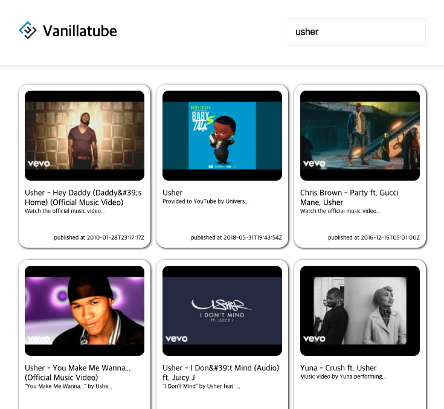
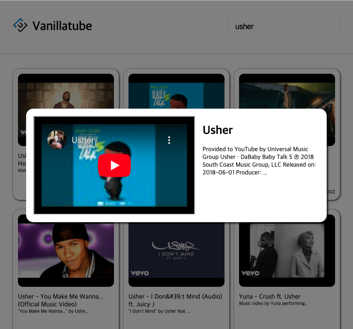

# Youtube Viewer

- Youtube API의 동영상 데이터를 fetching하여 유튜브 메인 페이지와 동영상 뷰어를 구현
- Infinity scroll 구현, lodash의 debounce를 leading 옵션으로 사용하여 가장 첫번째로 인식한 스크롤 이후 2초간의 모든 스크롤에서 보내는 fetch 요청을 무시함으로써 data fetching에 드는 비용 최소화
- 검색시 사용되는 input에 등록된 event listener에는 debounce를 trailing 옵션으로 사용하여 2초의 대기시간 이후 가장 마지막에 해당하는 input 값만을 가지고 fetch 요청을 보내도록 하여 통신 비용 최소화
- React router를 사용하여 동영상 상세뷰어를 Modal로 구현

